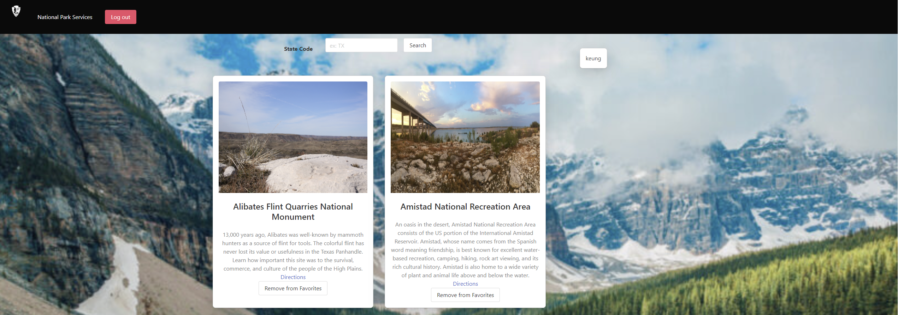

# ParcsNRecs with Bulma CSS

## Introduction

ParcsNRecs with Bulma CSS is a responsive web application that allows users to browse, search, and explore information about National Parks through the National Parks Services API. It's built using the Bulma CSS framework, which provides a clean and modern user interface. It also uses Node.js and Express.js for the back end while using the MVC paradigm and Handlebars.js as the template engine.

## Table of Contents
- [Features](#features)
- [Demo](#demo)
- [Installation](#installation)
- [Usage](#usage)
- [Credits](#credits)

##  Features

- Search for National Parks by state.
- View National Parks and their descriptions.
- Make your own personal profile.
- Mark and save your favorite Parks.
- Save and Delete your favorite Parks.
- Responsive design for an optimal viewing experience on both desktop and mobile devices.
- Launched through Heroku.
- Uses Handlebars.js as the template engine.
- Uses Node.js and Express.js for the back end.
- Bulma.io for CSS framework.

## Demo

-   See the live demo of ParcsNRecs with Bulma CSS: https://whispering-beyond-13977-ec09eded4ce5.herokuapp.com/

## Installation

- To run this project locally, follow these steps:

1. Clone the repository: 

        "$ git clone https://github.com/FractalIceCream/ParcsNRecs.git"

## Usage

-   Upon loading the website, you can start searching for National Parks using the search bar by typing in a state of your choice.
-   View details on National Parks upon search including the Name and a description of the park.
-   Make your own personal list of favorite National Parks by signing up for your own profile.
-   Save your favorite Parks by clicking on the "Add to Favorites" button.
-   Unsave favorite Parks by clicking the "Remove from Favorites" button.
-   Access your favorite Parks by clicking on the red "Profile" button.
-   Enjoy exploring and discovering National Parks!

## Credits

- Vincent Roco https://github.com/FractalIceCream
- Luis Gonzalez https://github.com/LgCodes94
- Keung Inthachak https://github.com/kyungda
- Victor Samuel https://github.com/VictorSamuel-dev
- Bulma CSS https://bulma.io/
- National Parks Services API https://developer.nps.gov/api/v1/
- Handlebars.js https://handlebarsjs.com/
- Heroku https://www.heroku.com/